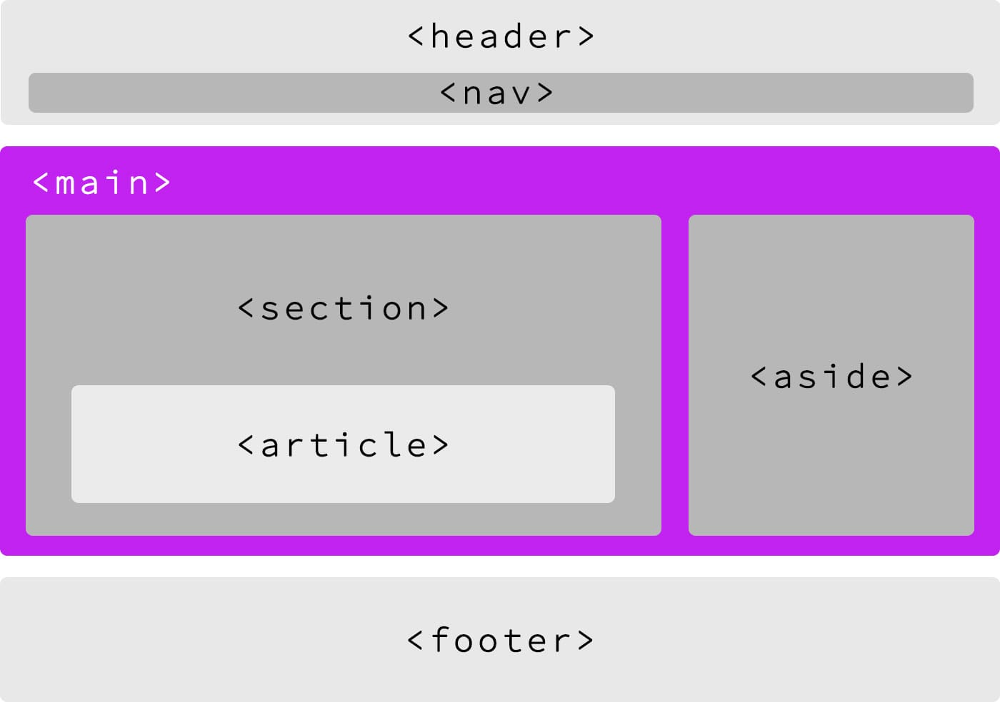
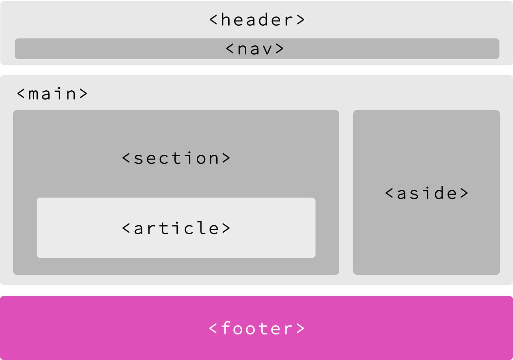
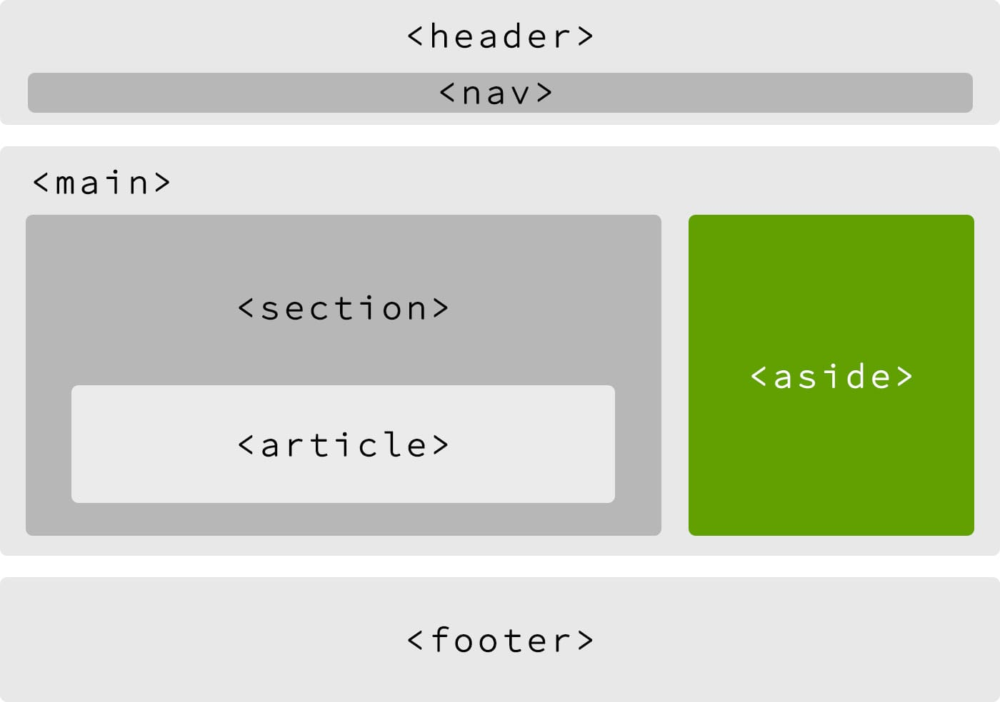
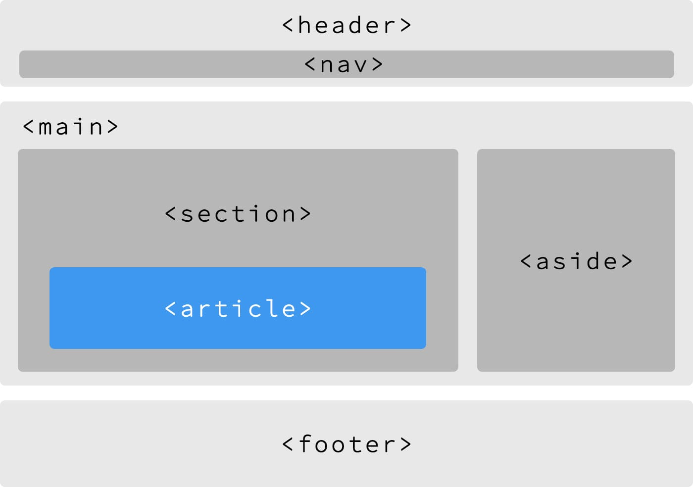

# 0x00-html_advanced

#### [HTML Tag](https://www.w3schools.com/tags/tag_html.asp)

`<html lang="en" dir="ltr"></html>`

- `HTML`: It's the root of the document and serves as the container for all other tags.
- `lang`: The `lang` attribute specifies the official language that the browser will use to provide the content.
- `dir`: The `dir` attribute specifies to the browser whether the content will start from left to right or right to left.

#### [Viewport](https://www.w3schools.com/css/css_rwd_viewport.asp)

`<meta name="viewport" content="width=device-width, initial-scale=1.0">`

- `meta`: It's a tag that provide all the data(information) to the browser, like how to display content or sreach engine...
- `width=device-width`: set the width auto depand on the device.
- `initial-scale=1.0`: if the page loaded by will be seted to the initial scale 1.

#### [Title Tag](https://www.w3schools.com/tags/tag_title.asp)

`<title>Homepage - Techium</title>`

- `title`: it's must and it displayed in the browser title bar

#### [Description]()

`<meta name="description" content="Techium is a digital agency" />`

- `description`: It's a tag used to describe what you're web page or website is about
  - A Good descriptions are human-readable and diverse

#### [Favicons]()

`<link rel="icon" type="image/x-icon" href="./favicon.ico" />`

`<link rel="icon" type="image/png" href="./favicon.png" />`

- Tool at https://realfavicongenerator.net/ to generate all the favicon formats.
- `rel`: stands for "relationship", icon for images or stylesheet for css ...
- `type`: contain the type of resources.
- `href`: the path where the icon or stylesheet exists.

---

## 3-index.html

### [Header](https://developer.mozilla.org/en-US/docs/Web/HTML/Element/header)

- `header`: The `<header>` HTML tag element is used to identify the top of a webpage, article, section, or other segment of a page. The header is normally always the same across all pages of your website.


- **Usage**
  - logo of the website
  - navigation
  - search form

```html
<body>
    <header>This is my header<header/>
</body>
```

##### ⚠️ WARNING

- The main element should never be a descendant of an `article`, `aside`, `header`, `footer`, or `nav` element.

> Don’t confuse header with the `head` element of the page.

### [Main]()

- `main`: The `<main>` HTML tag is a structural element located generally between the `<header>` and the `<footer>` and contains the content of your web page.

## 

```html
<body>
  <header>This is my header</header>
  <main>This is where I put my content</main>
</body>
```

### [Footer](https://developer.mozilla.org/en-US/docs/Web/HTML/Element/footer)

- `footer`: The `<footer>` HTML tag is a structural element used to identify the footer of a page, article, or section.

## 

```html
<body>
    <header>This is my header<header/>
    <main>
        This is where I put my content
    </main>
    <footer>This is the footer of my page</footer>
</body>
```

- **Usage**
  - copyright information
  - authorship information
  - navigation elements
  - social icons or links

---

## article.html

### [aside Tag]()

- `aside`: The `<aside>` HTML tag contains additional information related to the main content.



```html
<body>
  ...
  <main>
    <section>
      <article>This is my article 1</article>
      <article>This is my article 2</article>
      <article>This is my article 3</article>
    </section>
    <aside></aside>
  </main>
  ...
</body>
```

- **Usage**
  - monthly archives
  - list of categories

---

## 5-index.html

### [section Tag](https://developer.mozilla.org/en-US/docs/Web/HTML/Element/section)

- `section`: The `<section>` tag element allows the grouping of related elements. You can usually find a `<header>` and `<footer>` attached to a section.


```html
<body>
  ...
  <main>
    <section>This is my section 1</section>
    <section>This is my section 2</section>
    <section>This is my section 3</section>
  </main>
  ...
</body>
```

---

## 6-index.html

## [article tag](https://developer.mozilla.org/en-US/docs/Web/HTML/Element/article)

- `article`: An `<article>` HTML tag represent a self-contained piece of content which could theoretically be distributed to other websites and platforms as a stand-alone unit.



```html
<body>
  ...
  <main>
    <section>
      <article>This is article 1</article>
      <article>This is article 2</article>
    </section>
  </main>
  ...
</body>
```

- **Usage**
  - blog posts
  - news articles
  - product cards
  - forum posts

---

## 7-index.html

## [nav tag](https://developer.mozilla.org/en-US/docs/Web/HTML/Element/nav)

- `nav`: The `<nav>` HTML tag is a structural element with navigation links.


```html
...
<body>
    <header> I'm inside the header
        <nav>
          <!-- This is an example of links -->
          <a href="/">Home</a>
          <a href="/about">About</a>
          <a href="/contact">Contact</a>
          <!-- / -->
        </nav>
    <header/>
    ...
</body>
```

---

## 8-index.html

## [Headings](https://developer.mozilla.org/en-US/docs/Web/HTML/Element/p)

Headings are used to define a section heading.
|Type | Self-closing|
|-----|-------------|
|Block|No |

##### ⚠️ WARNING

- Browsers apply different sizes for each heading in their default CSS rules. Keep in mind that HTML is about content and not the styling. Never use an h4 after an h2. For example, always keep a descendant order (h1 > h2 > h3…).

#### ✅ Accessibility tip

- Headings are used by voice browser to help navigate through the webpage.

```html
<h1>This is my title level 1</h1>
<h2>This is my title level 2</h2>
...
```

#### 🔰 Tip

- Never put the logo or name of your website inside an `<h1>`. The text inside this tag has to reflect the content of your page. On a homepage, based on the design, you can eventually hide visually your `<h1>` but it still has to exist in your code.

---

## 9-index.html

## [`p` tag](https://developer.mozilla.org/en-US/docs/Web/HTML/Element/p)

- `p`: A `<p>` HTML tag defines a paragraph of text.
  |Type | Self-closing|
  |-----|-------------|
  |Block|No |

```html
<p>Lorem ipsum dolor sit amet, consectetur adipiscing elit.</p>
```

##### ⚠️ WARNING

- If you need a container to wrap multiple elements, use `div` instead of `p`. Only use the paragraph tag if your content could be considered a paragraph of text.

---

## 14-index.html + 15-index.html

> `div` and `span` don’t possess any semantic meaning. They are mostly used to define a `block` (div) of content, or an `inline` (span) content.

## [span]()

- `span`: A `span` is a generic inline of content used usually for text that are not inside a paragraph. `span` should be used as little as possible.

```html
<span>This is my first span</span>
```

| Type   | Self-closing |
| ------ | ------------ |
| inline | No           |

## [div]()

- `div`: A `div` (stands for “document division”) is a generic block of content used to structure elements in your layout.

```html
<div>This is my first div</div>
```

| Type  | Self-closing |
| ----- | ------------ |
| Block | No           |

## 16-index.html

## [Comments](<https://learn.microsoft.com/en-us/previous-versions/windows/internet-explorer/ie-developer/compatibility/ms537512(v=vs.85)?redirectedfrom=MSDN>)

- `Comments`: Comments allow you to add some information visible for the developer but not for the normal user. Comments are not visible on your page.

```html
<!-- This is a comment about how much I love eggs! -->
```

---

## 18-index.html

## [`a` tag](https://developer.mozilla.org/en-US/docs/Web/HTML/Element/a)

## [link 2](https://mathiasbynens.github.io/rel-noopener/)

## [link 3](https://css-tricks.com/snippets/html/mailto-links/)

- Links are inline elements which allow you to navigate from one page / document to another.

  | Type   | Self-closing |
  | ------ | ------------ |
  | Inline | No           |

- There are 3 types of targets:

- anchor targets, to navigate within the same page

```html
<a href="#services">Link</a> <-- anchor target -->$
```

- relative URLs, usually to navigate within the same website

```html
<a href="/blog">Link</a> <-- relative url -->
```

- absolute URLs, usually to navigate to another website

```html
<a href="https://www.example.com">Link</a> <-- absolute url -->
```

### [Future changes in the link attribution (rel)](https://developers.google.com/search/blog/2019/09/evolving-nofollow-new-ways-to-identify?hl=fr)

### [link 2](https://moz.com/blog/nofollow-sponsored-ugc)

```html
<div>
  <div>
    <a href="#" rel="noopener" target="_blank">Link open in a new tab</a>
  </div>
  <div>
    <a href="#" rel="sponsored">Paid and sponsored links</a>
  </div>
  <div>
    <a href="#" rel="ugc">User-generated content</a>
  </div>
  <div>
    <a href="#" rel="nofollow">Catch-all for all non-trusted links</a>
  </div>
</div>
```

## 

## 20-index.html

## [`Lists`](https://developer.mozilla.org/en-US/docs/Web/HTML/Element/ul)

## [`<li>: The List Item element`](https://developer.mozilla.org/en-US/docs/Web/HTML/Element/li)

- Lists are used for listing ingredients in a recipe, a series of social icons, etc..
  | Type | Self-closing |
  | ------ | ------------ |
  | Inline | No |

## [Ordered list (ol)](https://developer.mozilla.org/en-US/docs/Web/HTML/Element/ol)

- An ordered list is rendered as a numbered list.

```html
<!-- an ordered list number -->
<ol>
  <li>List item 1</li>
  <li>List item 2</li>
  <li>List item 3</li>
</ol>
<!-- an ordered list width Roman numerals -->
<ol type="i">
  <li>List item 1</li>
  <li>List item 2</li>
  <li>List item 3</li>
</ol>
```

## [Unordered list (ul)]()

- An unordered list is rendered as an unordered list of items.

```html
<!-- flat list -->
<ul>
  <li>First bullet point</li>
  <li>Second bullet point</li>
  <li>Third bullet point</li>
</ul>
<!-- list with a nested list -->
<ul>
  <li>First bullet point</li>
  <li>
    Second bullet point
    <!-- Nested unorderd lit -->
    <ul>
      <li>First bullet point</li>
      <li>Second bullet point</li>
      <li>Third bullet point</li>
    </ul>
  </li>
  <!-- Closing li tag -->
  <li>Third bullet point</li>
</ul>
```

## [Definition list](https://developer.mozilla.org/en-US/docs/Web/HTML/Element/dl)

- A definition list is used to list terms and corresponding definitions.

```html
<dl>
  <dt>Term</dt>
  <dd>Definition of the term</dd>
  <dt>Another term</dt>
  <dd>Another definition of the term</dd>
</dl>
```

---

## 27-index.html

## [Horizontal rules](https://developer.mozilla.org/en-US/docs/Web/HTML/Element/hr)

- An `hr` is a semantic break that separates different blocks of text.
  | Self-closing |
  | ------ |
  | Yes |

```html
<p>Lorem ipsum dolor sit amet, consectetur adipiscing elit.</p>
<hr />
<h2>Section</h2>
<p>Lorem ipsum dolor sit amet, consectetur adipiscing elit.</p>
```

## [Line Breaks](https://developer.mozilla.org/en-US/docs/Web/HTML/Element/br)

- Line breaks are used to break the text to multiple lines.
  | Self-closing |
  | ------ |
  | Yes |

```html
<p>
  Lorem ipsum dolor sit amet, consectetur adipiscing elit. <br />
  Donec viverra<br />
  nec<br />
  nulla vitae mollis
</p>
- Never use line breaks for presentation purpose, to create space between
elements in your design. Spacing and layout should only be handled by CSS.
```

---

## 29-index.html

## [Inline quotation](https://developer.mozilla.org/en-US/docs/Web/HTML/Element/q)

- Inline quotes is used for inline text that doesn’t require paragraph breaks.

```html
<p>
  According to Mozilla's website,
  <q cite="https://www.mozilla.org/en-US/about/history/details/">
    Firefox 1.0 was released in 2004 and became a big success.
  </q>
</p>
```

## [Blockquote](https://developer.mozilla.org/en-US/docs/Web/HTML/Element/blockquote)

- A multiline quote is called a blockquote.
  | Type | Self-closing |
  | ------ | ------------ |
  | Block | No |

```html
<!-- DO -->
<blockquote cite="https://tools.ietf.org/html/rfc1149">
  <p>
    Avian carriers can provide high delay, low throughput, and low altitude
    service. The connection topology is limited to a single point-to-point path
    for each carrier, used with standard carriers, but many carriers can be used
    without significant interference with each other, outside of early spring.
    This is because of the 3D ether space available to the carriers, in contrast
    to the 1D ether used by IEEE802.3. The carriers have an intrinsic collision
    avoidance system, which increases availability.
  </p>
</blockquote>
<!-- DON'T -->
<blockquote>For writing maintainable and scalable HTML documents.</blockquote>
<!-- Blockquote with a cite reference -->
<blockquote>
  <p>
    People think focus means saying yes to the thing you’ve got to focus on. But
    that’s not what it means at all. It means saying no to the hundred other
    good ideas that there are. You have to pick carefully. I’m actually as proud
    of the things we haven’t done as the things I have done. Innovation is
    saying no to 1,000 things.
    <cite>Steve Jobs – Apple Worldwide Developers’ Conference, 1997</cite>
  </p>
</blockquote>
```

---

## 31-index.html

## [Text/Typography]()

- A long list of HTML tags are used to give semantic meaning to specific text. Each tag is essential to help users and browsers understand the specificity of a certain portion of text. It’s crucial to understand which can be used in which situation.

- `<em>` to indicate stress emphasis.
- `<i>` to indicate text set off from the normal prose (foreign word, technical term…).
- `<strong>` to indicate stronger importance.
- `<b>` to draw attention to specific content (keywords in a summary, product names in a review…).
- `<small>` to represent side-comments or small text (copyright, legal text…).
- `<del>` to represent a text that has been deleted.
- `<ins>` to represent a text that has been inserted.
- `<s>` to render text with a strikethough or a line through it.
- `<wbr>` to specify where the text could have a line-break.
- `<mark>` to indicate relevance, representing text marked or highlighted for reference.
- `<cite>` to mark the name of a work, such as a book, play, or song.
- `<dfn>` to mark the defining instance of a term.
- `<abbr>` to represents an abbreviation or acronyme.
- `<code>` to indicate at short fragment of computer code.
- `<time>` to indicate a specific period in time.
- `<address>` to indicate contact information (person, people or organization).

##### ⚠️ WARNING

- Some tags like `<strong>` and `<b>` may look the same visually in your browser. Please remember that HTML is about content, semantics, and not the visual aspect.

```html
<ul>
  <li>
    I <em>really</em> like driving in San Francisco.
  </li>
  <li>
    The term <i>voilier</i> is a french word which mean "sailing ship".
  </li>
  <li>
    <strong>Warning!</strong> This is not a drill!
  </li>
  <li>
    <b>This text is bold.</b>
  </li>
  <li>
    <p>Atomic Habits: An Easy & Proven Way to Build Good Habits & Break Bad Ones <small>(Penguin Group USA) <small>Kindle Edition</small>
by</small> James Clear <small>  (Author)</small></p>
  </li>
  <li>
    <p>I'm silently correcting <del>you're</del> <ins>your</ins> grammar.</p>
  </li>
  <li>
    I received <s>$500</s> $1000 for that job!
  </li>
  <li>
    I want to understand <wbr>what</wbr><wbr>is</wbr><wbr>going</wbr><wbr>on</wbr>!
  </li>
  <li>
    <mark>This whole text should be highlighted in yellow.</mark>
  </li>
  <li>
    <blockquote>
    Any inaccuracies in this index may be explained by the fact that it has been sorted with the help of a computer.<br>
    — from <cite>The Art of Computer Programming</cite> by Donald Knuth
    </blockquote>
  </li>
  <li>
    <p>The <strong>HTML Definition element</strong>
    (<strong><dfn>&lt;dfn&gt;</dfn></strong>) is
    used to indicate the term being defined within the context<br/> of a
    definition phrase or sentence.</p>
  </li>
  <li>
    <p>You are the <abbr title="Cascading Style Sheets">CSS</abbr> of my <abbr title="HyperText Markup Language">HTML</abbr>.</p>
  </li>
  <li>
    <code></code>
  </li>
  <li>
    <pre>
      <code>
        body {
          color: red;
        }
      </code>
    </pre>
  </li>
  <li>
    <time datetime="2019-09-19">Sept 19, 2019</time>
  </li>
  <li>
    <address>
      <a href="mailto:someone@example.com">someone@example.com</a>
    </address>
  </li>
</ul>
```

---

## 31-index.html

## [Tables](https://developer.mozilla.org/en-US/docs/Web/HTML/Element/table)

- A table element is used to wrap tabular content. It uses rows and columns to organize the data.

#### ✅ Accessibility tip

- Always use `<caption>` to help people understand the content of your table.

##### Anatomy of a table

caption: the title of a table.

- `thead`: groups multiple rows that represents the head of the columns
- `tbody`: groups multiple rows that represents the body of the table
- `tfoot`: groups multiple rows that represents the footer of the table
- `th`: a cell as header of a group of table cells
- `tr`: a row of cells
- `td`: a cell of a table
- `col attribute`: defines a column within a table.
- `colgroup attribute`: defines a group of columns within a table.

```html
<!-- Table with thead, tfoot, and tbody -->
<table>
  <caption>
    The table
  </caption>
  <thead>
    <tr>
      <th scope="col">Header content 1</th>
      <th scope="col">Header content 2</th>
      <th scope="col">Header content 3</th>
    </tr>
  </thead>
  <tbody>
    <tr>
      <th scope="row">Body content 1</th>
      <td>Body content 2</td>
      <td>Body content 3</td>
    </tr>
  </tbody>
  <tfoot>
    <tr>
      <th scope="row">Footer content 1</th>
      <td>Footer content 2</td>
      <td>Footer content 3</td>
    </tr>
  </tfoot>
</table>
<!-- Table without scope -->
<table>
  <caption>
    The table
  </caption>
  <thead>
    <tr>
      <th>Header content 1</th>
      <th>Header content 2</th>
    </tr>
  </thead>
  <tbody>
    <tr>
      <td>Body content 1</td>
      <td>Body content 2</td>
    </tr>
  </tbody>
  <tfoot>
    <tr>
      <td>Footer content 1</td>
      <td>Footer content 2</td>
    </tr>
  </tfoot>
</table>
```

---

## 34-styleguide.html

## [`details` tag](https://developer.mozilla.org/en-US/docs/Web/HTML/Element/details)

- The `<details>` HTML element gives a native way to create something similar to an accordion.

```html
<details>
  <summary>Details</summary>
  Something small enough to escape casual notice.
</details>
```

---

## 35-index.html

## [Image](https://developer.mozilla.org/en-US/docs/Web/HTML/Element/img)

- The image element (``) allows us to use images on a website.
  | Type | Self-closing |
  | ------ | ------------ |
  | Inline | Yes |

#### ✅ Accessibility tip

- You should always have an alt on your image. With text or without, depending if your image is decorative or not. The alt should describe what is inside your image. Never use the title of your blog post or some similar text.

#### 🔰 Tip

- Always specify the width and height of the image. It will avoid layout jank during image loading. Chrome and other browsers are working (Firefox already has that functionality) on improving the experience.

```html
<!-- using a url relative to the HTML page -->

<!-- using an absolute url from another website -->

```

##### [Placeholder generators]()

- [https://placebear.com/](https://placebear.com/)
- [https://picsum.photos/](https://picsum.photos/)
- [http://placehold.it/](https://www.placeholder.com/)
- [https://www.placecage.com/](https://www.placecage.com/)

## [Image formats]()

- `JPEG`, `PNG`, `GIF`, `SVG` and `WebP` are the most common format of image used on the Web. Each of them has his own particularity and usage. It’s essential to understand these and always ensure that they are optimized to be shown on a webpage.

- [Support image format](https://developer.mozilla.org/en-US/docs/Web/HTML/Element/img#supported_image_formats)
- [JPEG, GIF, PNG OR SVG - Which should You use?](https://dev.to/sarah_chima/jpeg-gif-png-or-svg---which-should-i-use-1o8o)
- [SVG vs PNG vs JPG: Image Format Pros & Cons | Design Shack](https://designshack.net/articles/graphics/svg-vs-png-vs-jpg/)
- [SVGOMG - SVGO’s Missing GUI](https://jakearchibald.github.io/svgomg/)

## [Picture](https://developer.mozilla.org/en-US/docs/Web/HTML/Element/picture)

- The `<picture>` HTML tag is used as a wrapper to combine different sources which provide different versions of an image. (It can also be use to offer different versions for different devices/display.)

```html
<picture>
  <source srcset="/img/logo.webp" type="image/webp" />
  <source srcset="/img/logo.jp2" type="image/jp2" />
  
</picture>
```

---

## [38-styleguide.html](https://developer.mozilla.org/en-US/docs/Web/HTML/Element/video)

- The `<video>` HTML Tag gives the capability to add a native video player in your HTML.

#### ✅ Accessibility tip

- It’s essential to provide an alternative text in case the `<video>` tag is not supported or the video doesn’t exist anymore.

#### 🔰 Tip

- Avoid using the attribute `autoplay` and let the user decide if they want to play the video. Of course, for videos used in the background, `autoplay` and `loop` will probably be essential.
  `

```html
<video
  width="640"
  height="480"
  src="https://archive.org/download/Popeye_forPresident/Popeye_forPresident_512kb.mp4"
  controls
>
  Sorry, your browser doesn't support HTML5 <code>video</code>, but you can
  download this video from the
  <a href="https://archive.org/details/Popeye_forPresident" target="_blank"
    >Internet Archive</a
  >.
</video>
```

---

## 39-styleguide.html

## [audio tag](https://developer.mozilla.org/en-US/docs/Web/HTML/Element/audio)

- The `audio` HTML Tag gives the capability to embed sound content in your HTML.

```html
<!-- single audio file -->
<audio src="/music/audiofile.mp3" controls>
  <!-- multiple audio files -->
  <audio controls>
    <source src="audiofile.mp3" type="audio/mpeg" />
    <source src="audiofile.ogg" type="audio/ogg" />
  </audio>
</audio>
```

---

## 39-styleguide.html

## [iframe tag](https://developer.mozilla.org/en-US/docs/Web/HTML/Element/iframe)

- An iframe embed an external browsing content in your current HTML page.

  | Type  | Self-closing |
  | ----- | ------------ |
  | Block | No           |

```html
<iframe
  title="Inline Frame Example"
  width="300"
  height="200"
  src="https://www.google.com/"
>
  Fallback text for non-supported browsers
</iframe>
```

#### ✅ Accessibility tip

- Always specify a title attribute on your iFrame.

#### 🔰 Tip

- Use iFrames with parcimony as they can add extra weight to your webpage.
